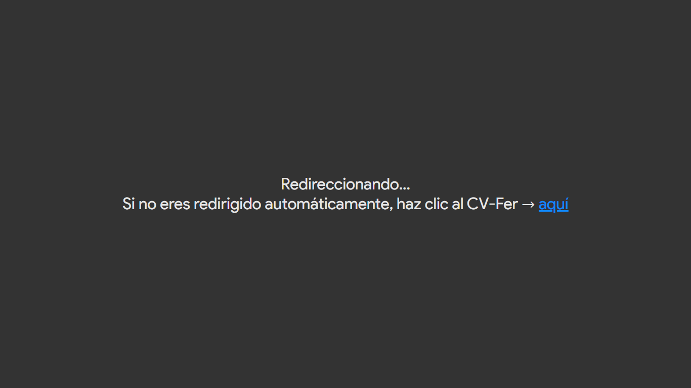

# 📄 Redirección Automática a PDF

Este es un proyecto muy simple realizado únicamente con **HTML**, cuyo propósito es redirigir automáticamente al usuario a un archivo PDF al ingresar al sitio web.

## 🚀 Tecnologías Utilizadas

- ✅ HTML5 puro

## ⚙️ Funcionamiento

Al ingresar a la página, el navegador redirige inmediatamente al archivo PDF especificado mediante una etiqueta `<meta>` o con JavaScript.

## 🎯 Objetivo del Proyecto

Este proyecto puede usarse para:

- Mostrar directamente un currículum o portafolio en PDF
- Proveer acceso rápido a documentos desde enlaces simples
- Reemplazar landing pages por contenido en PDF

## 🖥️ Capturas de pantalla

